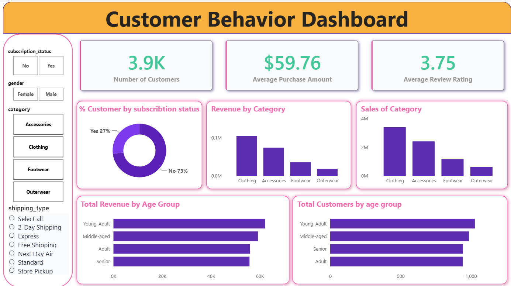

# 🛍️ Customer Behavior Dashboard

## 📌 Project Overview

The Customer Behavior Dashboard is an interactive Power BI dashboard designed to analyze customer purchasing patterns, subscription trends, product category performance, and demographic behavior. The dashboard helps businesses gain actionable insights into customer engagement and revenue generation.

---

## 🎯 Objective

The primary goal of this project is to:

- Understand customer purchasing behavior.
- Analyze subscription status distribution.
- Identify top-performing product categories.
- Evaluate revenue contribution by age groups.
- Monitor customer satisfaction through review ratings.
- Support data-driven business decisions.

---

## 📊 Dashboard KPIs

| KPI | Value |
|------|--------|
| Total Customers | 3.9K |
| Average Purchase Amount | $59.76 |
| Average Review Rating | 3.75 |
| Subscription Customers | 27% |
| Non-Subscription Customers | 73% |

---

## 📈 Dashboard Insights

### Customer Subscription Analysis
- 73% of customers are not subscribed.
- Only 27% of customers have active subscriptions.
- Significant opportunity exists to improve membership adoption.

### Revenue by Category
- Clothing generates the highest revenue.
- Accessories contribute the second-highest revenue.
- Footwear and Outerwear contribute comparatively lower revenue.

### Sales Performance
- Clothing records the highest sales volume.
- Accessories follow as the second most purchased category.
- Outerwear shows the lowest sales performance.

### Revenue by Age Group
- Senior customers generate the highest revenue.
- Middle-aged and Young Adult customers contribute similarly.
- Adult customers contribute the lowest revenue among all groups.

### Customer Satisfaction
- Average review rating is 3.75 out of 5.
- Indicates moderate customer satisfaction with opportunities for improvement.

---

## 🛠️ Tools & Technologies Used

- Power BI
- Power Query
- DAX
- Microsoft Excel / CSV Dataset
- Data Modeling
- Data Visualization

---

## 📋 Features Implemented

- Interactive Slicers
- Dynamic KPI Cards
- Donut Charts
- Bar Charts
- Category-wise Revenue Analysis
- Customer Segmentation
- Subscription Analysis
- Age Group Analysis
- Responsive Dashboard Design

---

## 📐 DAX Measures Used

```DAX
Total Customers =
COUNT(Customer[Customer_ID])

Average Purchase Amount =
AVERAGE(Customer[Purchase_Amount])

Average Rating =
AVERAGE(Customer[Review_Rating])

Total Revenue =
SUM(Customer[Purchase_Amount])

Total Sales =
COUNT(Customer[Order_ID])
```

---

## 📷 Dashboard Preview



---

## 💼 Business Value

This dashboard enables businesses to:

- Understand customer demographics.
- Improve subscription conversion rates.
- Identify profitable product categories.
- Optimize marketing strategies.
- Increase customer retention.
- Enhance customer experience.

---

## 🚀 Future Enhancements

- Customer Lifetime Value (CLV) Analysis
- Customer Churn Prediction
- Sales Forecasting
- Profitability Analysis
- Regional Performance Analysis
- Advanced Customer Segmentation

---
## 👨‍💻 Author

### Ramu Patro

Aspiring Data Scientist | Machine Learning Enthusiast | Data Analyst

[](https://github.com/ramupathro07)

[](https://www.linkedin.com/in/patro-ramu-0b2587231)

⭐ If you found this project useful, consider giving it a star.

💡 Open to Data Science, Machine Learning, and Data Analyst opportunities.

---

## ⭐ Project Status

Completed and available for portfolio demonstration and business analytics learning purposes.
